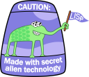

# Loria

[](https://content.minetest.net/packages/siegment/loria/)



Minetest 5.7.0+, still WIP. [Craft list](manuals/craft_list.md).

You can get the latest build via:

```bash
wget `curl -s https://api.github.com/repos/forked-from-1kasper/loria/releases/latest | jq -r '.assets[0].browser_download_url'`
```

**Do not use v6 map generator.**

## Authors

* [Žigmund Bratišek](https://github.com/Borschemancer)

* [Aritz Erkiaga](https://github.com/aerkiaga)

* [Siegmentation Fault](https://github.com/forked-from-1kasper)

## License

Copyright © 2020–2024 The Loria Developers

This program is free software: you can redistribute it and/or modify
it under the terms of the GNU General Public License as published by
the Free Software Foundation, either version 3 of the License, or
(at your option) any later version.

This program is distributed in the hope that it will be useful,
but WITHOUT ANY WARRANTY; without even the implied warranty of
MERCHANTABILITY or FITNESS FOR A PARTICULAR PURPOSE. See the
GNU General Public License for more details.

You should have received a copy of the GNU General Public License
along with this program. If not, see <https://www.gnu.org/licenses/>.
